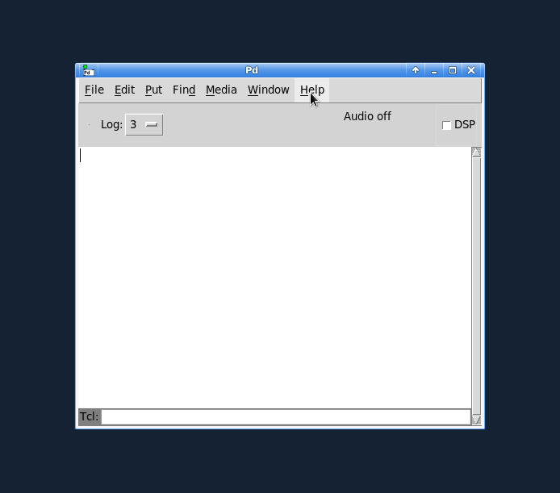

Deken Package Manager
=====================

**deken** is a [Pure Data](https://puredata.info)'s built-in *package manager*.

It can be used to install *external libraries* to enhance the functionality of Pd.

While it is mainly targeted at [Pd vanilla](https://msp.ucsd.edu/software.html),
it can be used with some other Pd flavours (like [Plug Data](https://plugdata.org/) as well.

Packages are stored on <http://puredata.info/> and can be installed using the `Help -> Find Packages` menu after installing the [GUI plugin](https://raw.githubusercontent.com/pure-data/deken/main/deken-plugin.tcl).

## README.1st ##

Since [`Pd-0.47`](http://puredata.info/downloads/pure-data/releases/0.47-0) (released in 2016)
the `deken-plugin` is included in Pure Data itself,
so the only reason to manually install it is to get the newest version.

Main development of the plugin is still happening in *this* repository,
so you might want to manually install the plugin to help testing new features.

When manually installing the `deken-plugin`, Pd will use it if (and only if) it has a greater version number
than the one included in Pd.
In this case you will see something like the following in the Pd-console (you first have to raise the verbosity to `Debug`):

> `[deken]: installed version [0.2.1] < 0.2.3...overwriting!`
> `deken-plugin.tcl (Pd externals search) in /home/frobnozzel/.local/lib/pd/extra/deken-plugin/ loaded.`

## Download/Install ##

On any recent version of Pd (that already comes with deken included), you can
use `Help -> Find Packages` itself to search and install newer versions of the
plugin.
Just search for `deken-plugin` and install the latest and greatest release of the plugin.

For manual installation (e.g. because you want to test a developer version of the plugin),
click to download [deken-plugin.tcl](https://raw.githubusercontent.com/pure-data/deken/main/deken-plugin.tcl)
and save it to your Pd folder:

 * Linux = `~/.local/lib/pd/extra/deken-plugin/` (with Pd<0.47 try `~/pd-externals/deken-plugin/`)
 * OSX = `~/Library/Pd/deken-plugin/`
 * Windows = `%AppData%\Pd\deken-plugin\`

Then select `Help -> Find Packages` and type the name of the external you would like to search for.

## Trusting packages

The `deken-plugin` will help you find and install Pd-libraries.
However, it does not verify whether a given package is downloaded from a trusted source or not.

As of now, the default package source is [http://puredata.info](http://puredata.info).
Anybody who has an account on that website (currently that's a few thousand people) can upload packages,
that the `deken-plugin` will happily find and install for you.

In order to make these packages more trustworthy, we ask people to sign their uploaded packages with the GPG-key.
Unfortunately the deken-plugin does not check these signatures yet.
If you are concerned about the authenticity of a given download, you can check the GPG-signature manually,
by following these steps:

- Navigate to `Help -> Find Packages` and search for an external
- Right-Click one of the search results
- Select "Copy package URL" to copy the link to the downloadable file to your clipboard
- Download the package from the copied link
- Back in the deken search results, select "Copy OpenGPG signature URL"
- Download the GPG-signature from the copied link to the same location as the package
- Run `gpg --verify` on the downloaded file

If the signature is correct, you can decide yourself whether you actually trust the person who signed:
- Do you trust the signature to be owned by the person?
- Do you know the person?
- Do you trust them enough to let them install arbitrary software on your machine?

## Links

- Development: [https://github.com/pure-data/deken](https://github.com/pure-data/deken)
- Documentation: [https://deken.readthedocs.io/](https://deken.readthedocs.io/)
- Development: [https://github.com/pure-data/deken/issues](https://github.com/pure-data/deken/issues)
