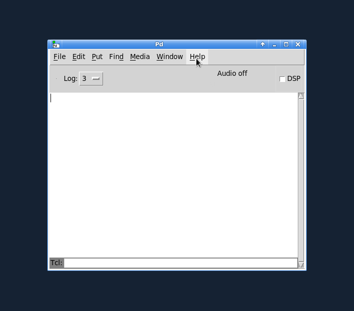

Using deken from within Pd
==========================

**deken** is a [Pure Data](https://puredata.info)'s built-in *package manager*.

It can be used to install *external libraries* to enhance the functionality of Pd.

It is mainly targeted at [Pd vanilla](https://msp.ucsd.edu/software.html),
but can be used with some other Pd flavours (like [Plug Data](https://plugdata.org/) as well.

Open the package manager via the `Tools` menu's select `Find externals` entry.

You can type and search for a library name, an object name or both.

## Searching
Any library which matches one (or more) words in the search field is returned.

E.g. searching for `zexy gemh` will return two results:

- the library `zexy` (as the library name matches the first search word `zexy`)
- the library `Gem` (as the library contains an object `[gemhead]` which matches the second search word `gemh`)

Leaving the search field empty will return all available libraries.

### Limiting search results

You can limit the search to only match libraries (but not object names), or vice versa.

E.g. selecting *both* (that is *libraries and objects*) and searching for the `freeverb` will return 

- the `freeverb~` library (as the library name matches)
- the `freeverb~` library (as the library contains an object `[freeverb~]`)
- the `chair` library (containing an object `[chair.vfreeverb~]`)
- the `ceammc` library (containing `[fx.freeverb~]` and `[fx.freeverb2~]`)

OTOH, selecting *libraries* (only) and searching for `freeverb` again
will only return the `freeverb~` library.

You can also enable **exact search**, where a library or object name has to match exactly,
where `freeverb~` will still match the *freeverb~* library/object, but no longer *chair.vfreeverb~* or *fx.freeverb2~*.

You can use the wildcards `?` (matching exactly one character) and `*` (matching any number of characters (including none))
to further refine your search.

E.g. `atan*~` will return all libraries containing objects that start with `atan` and end with `~`
(like `[atan~]`, `[atan2~]` and `[atanh~]`).
OTOH, `atan?~`will only return libraries containing objects like `[atan2~]` or `[atanh~]`.
Libraries that only contain objects like `[atan]` (without a trailing `~`) or `[math.atanh~]` (with leading `math.`)
will not be returned.

### Incompatible and outdated libraries

By default, only libraries that are compatible with the running Pd are displayed.
Also, only the latest matching version is shown.

If you are interested in older versions of libraries (or in libraries compiled for other systems),
you can enable them via the preferences.

## Installing packages

Once you are happy with the search results, select the libraries you want to install (by left-clicking them),
and click the <kbd>Install</kbd> button.

This will download the selected packages,
remove previous installations of the libraries (by deleting any folder named like the to-be-installed libraries),
and install the new packages by unzipping them.

You can prevent the removal of old versions of the libraries via the preferences.

### Trusting packages

!!! note
    Packages can contain arbitrary code.

    Please read the chapter on [trusting packages](trust.md).

### Installing package files

You can also install previously downloaded deken packages (files ending with the `.dek` extension).
After opening the deken package manager, use the `File` menu's `Install DEK file...` entry.
Select the deken packge and install it.

Deken packages can be downloaded from the search results:

- *Right click* a search result
- Select `Copy package URL` from the context menu
- Open your favourite browser and copy the package URL from the clipboard

Alternatively, you can find and download packages via the [webinterface](webpage.md).
# Download/Install deken itself ##

Since [`Pd-0.47`](http://puredata.info/downloads/pure-data/releases/0.47-0) (released in 2016)
the `deken-plugin` is included in Pure Data itself,
so the only reason to manually install it is to get the newest version.

Main development of the plugin is still happening in *this* repository,
so you might want to manually install the plugin to help testing new features.

When manually installing the `deken-plugin`, Pd will use it if (and only if) it has a greater version number
than the one included in Pd.
In this case you will see something like the following in the Pd-console (you first have to raise the verbosity to `Debug`):

> `[deken]: installed version [0.2.1] < 0.2.3...overwriting!`
> `deken-plugin.tcl (Pd externals search) in /home/frobnozzel/.local/lib/pd/extra/deken-plugin/ loaded.`

### Updating deken ###

On any recent version of Pd (that already comes with deken included), you can
use `Help -> Find Packages` itself to search and install newer versions of the
plugin.
Just search for `deken-plugin` and install the latest and greatest release of the plugin.

For manual installation (e.g. because you want to test a developer version of the plugin),
download the [deken-plugin.tcl](https://raw.githubusercontent.com/pure-data/deken/main/deken-plugin.tcl)
and save it to your Pd folder:

 * Linux = `~/.local/lib/pd/extra/deken-plugin/` (with Pd<0.47 try `~/pd-externals/deken-plugin/`)
 * OSX = `~/Library/Pd/deken-plugin/`
 * Windows = `%AppData%\Pd\deken-plugin\`

Then select `Help -> Find Packages` and type the name of the external you would like to search for.

## Links

- Development: [https://github.com/pure-data/deken](https://github.com/pure-data/deken)
- Documentation: [https://deken.readthedocs.io/](https://deken.readthedocs.io/)
- Development: [https://github.com/pure-data/deken/issues](https://github.com/pure-data/deken/issues)
